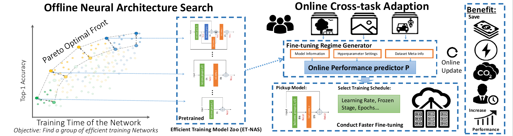
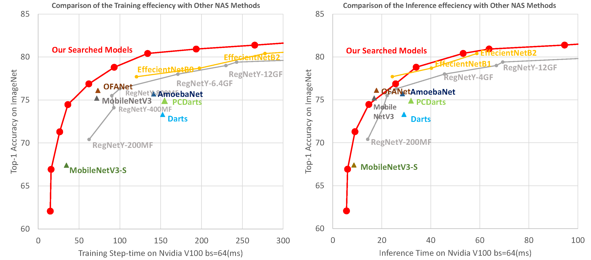

# NASOA

This repository is for our paper "**Faster Task-oriented Online Fine-tuning**", which contains the Efficient Training model zoo for fast training and fine-tuning.

## Faster Task-oriented Online Fine-tuning
Exploring how to adapt efficient neural networks to various downstream tasks online.


## Efficient Training (ET-NAS) Model-Zoo 
We provide our state-of-the-art Efficient Training model-zoo for fast training and fine-tuning to save computational cost. 



**Detailed performances of our ET-NAS:**  
| Model Name | MParam | GMac  | Top-1 | Inference Time  (ms) | Training Step Time (ms) | Checkpoints |
| ---------- | ------ | ----- | ----- | -------------------- | ----------------------- | ----------- |
| ET-NAS-A   | 2.6    | 0.23  | 62.06 | 5.30                 | 14.74                   | [Google Drive](https://drive.google.com/file/d/1BjMFriEuy9ypo7swm-eaT-LGzk8HYttK/view?usp=sharing) |
| ET-NAS-B   | 3.9    | 0.39  | 66.92 | 5.92                 | 15.78                   | [Google Drive](https://drive.google.com/file/d/19D1xI0PwJ9sxuAzVNt84bTzfd0e0GwNJ/view?usp=sharing) |
| ET-NAS-C   | 7.1    | 0.58  | 71.29 | 8.94                 | 26.28                   | [Google Drive](https://drive.google.com/file/d/1d4lW1DW3j0ANwTh6HdLGGbI1B2N30p3Y/view?usp=sharing) |
| ET-NAS-D   | 15.2   | 1.55  | 74.46 | 14.54                | 36.30                   | [Google Drive](https://drive.google.com/file/d/1n7jbTnwln4MSJOaHwMr-Ssw_zLk8D4-L/view?usp=sharing) |
| ET-NAS-E   | 21.4   | 2.61  | 76.87 | 25.34                | 61.95                   | [Google Drive](https://drive.google.com/file/d/1ftpJO9F9qfYd7zC3Q2iRvEXW7qH5rDt5/view?usp=sharing) |
| ET-NAS-F   | 28.4   | 2.31  | 78.80 | 33.83                | 93.04                   | [Google Drive](https://drive.google.com/file/d/1Gn50zC7eWf8KX1GQNZx8-wcccgXZoKx2/view?usp=sharing) |
| ET-NAS-G   | 49.3   | 5.68  | 80.41 | 53.08                | 133.97                  | [Google Drive](https://drive.google.com/file/d/17iZ6pQsZZlfOdZSz8E7Okv2rgOBnkAd5/view?usp=sharing) |
| ET-NAS-H   | 44.0   | 5.33  | 80.92 | 76.80                | 193.40                  | [Google Drive](https://drive.google.com/file/d/1UvRkpn9T1XNX1I4l2DGGW4MywvAZeNV6/view?usp=sharing) |
| ET-NAS-I   | 72.4   | 13.13 | 81.38 | 94.60                | 265.13                  | [Google Drive](https://drive.google.com/file/d/1fUcEqn2esPtt2YWEmaoSfaUpqmhwnK6o/view?usp=sharing) |
| ET-NAS-J   | 103.0  | 18.16 | 82.08 | 131.92               | 370.28                  | [Google Drive](https://drive.google.com/file/d/1XH08-mGJwy4FmZalYi0pbumoqasJz1NV/view?usp=sharing) |
| ET-NAS-K   | 87.3   | 27.51 | 82.42 | 185.75               | 505.00                  | [Google Drive](https://drive.google.com/file/d/1F78jjdNyAMjC0Z4hh-JdDFfByOPemR4i/view?usp=sharing) |
| ET-NAS-L   | 130.4  | 23.46 | 82.65 | 191.89               | 542.52                  | [Google Drive](https://drive.google.com/file/d/1d5MNsjX17fNbz1CMCMI6gelpdyoYqwMJ/view?usp=sharing) |


### How to use ET-NAS 

#### Use ET-NAS in your own project

```python
from etnas import ETNas, MODEL_MAPPINGS
model_name = "ET-NAS-A"

# construct a ET-NAS network
network = ETNas(MODEL_MAPPINGS[model_name])

# load pre-trained model weights
network.load_state_dict(torch.load("{}.pth".format(MODEL_MAPPINGS[model_name])))
```

You can download alll pre-trained model directly from: [Google Drive](https://drive.google.com/file/d/1cwE1RGsNoBR8enOr79-iw45Porkglv_k/view?usp=sharing).  
After unzipping the file, the file structure should be like:
```
ET-NAS
──ET-NAS-A
│      2-_32_2-11-112-1121112.pth
├─ET-NAS-B
│      031-_32_1-1-221-11121.pth
├─ET-NAS-C
│      011-_32_2-211-2-111122.pth
├─ET-NAS-D
│      031-_64_1-1-221-11121.pth
├─ET-NAS-E
│      10001-_64_4-111-11122-1111111111111112.pth
├─ET-NAS-F
│      011-_64_21-211-121-11111121.pth
├─ET-NAS-G
│      10001-_64_4-111111111-211112111112-11111.pth
├─ET-NAS-H
│      211-_64_41-211-121-11111121.pth
├─ET-NAS-I
│      02031-a02_64_111-2111-21111111111111111111111-211.pth
├─ET-NAS-J
│      211-_64_411-2111-21111111111111111111111-211.pth
├─ET-NAS-K
│      02031-a02_64_1121-111111111111111111111111111-21111111211111-1.pth
└─ET-NAS-L
       23311-a02c12_64_211-2111-21111111111111111111111-211.pth
```
where each checkpoint file is named with the corresponding architecture encoding and saved into a folder with the series name.

#### Example: Running test on Imagenet

```python
python test.py \
       --model-name ET-NAS-A \ 
       --data-dir imagenet \ # path to dataset, imagenet for example
       --model-zoo-dir model_zoo \ # path to pre-trained models, modelz_zoo for example
       --batch-size 256 \ # batch size on each card
       --num-workers 4 \ # number of workers
       --device cuda:0 # device to run the network, set "cuda" for gpus and "cpu" for cpu
```

